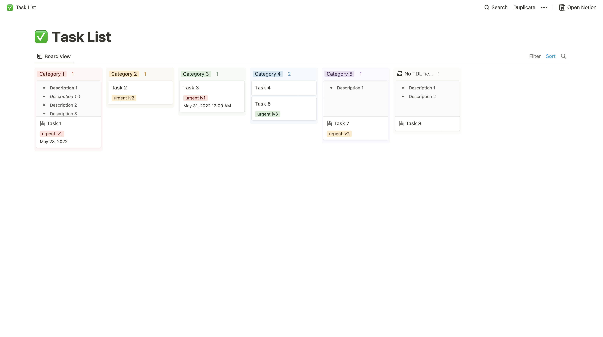
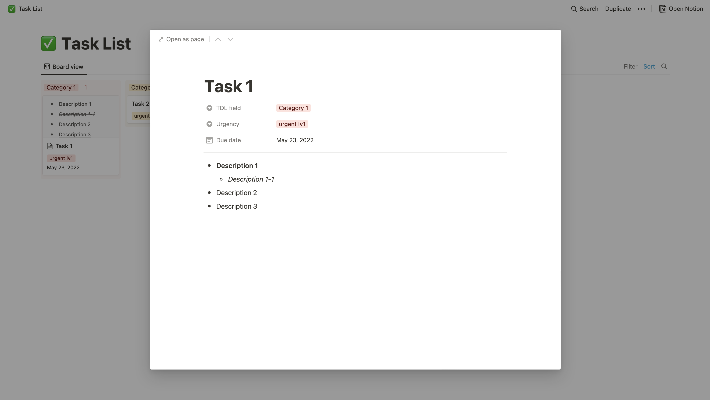
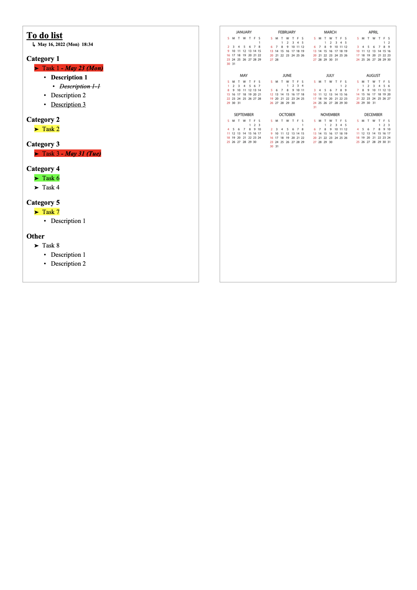

# Notion TDL Parser

---

`Notion TDL (To Do List) Parser` is a project that parses [Notion board view style task list template](https://excellent-avocado-be1.notion.site/121781a5d270403ca6b560c3d149aabe?v=91869e9d847b4a378bee5d7cb52ee009) into a printable Word document.


Notion board view style task list template:




Parsed task list document:




### Usage

---
1. Save and edit [Notion board view style task list template](https://excellent-avocado-be1.notion.site/121781a5d270403ca6b560c3d149aabe?v=91869e9d847b4a378bee5d7cb52ee009)
2. Download this Python project
3. Open `./notion/constants.py` and set Notion authorization token and Notion task list database id into corresponding fields:

```
class NotionConstants:
    authorization = "{your_authorization_token}"
    database_id = "{your_db_id}"
```
3. Run `./notion_tdl_parser.py`:
```
python3 ./notion_tdl_parser.py {document_output_path}
```

### Note

---
   1. Within a [Notion board view style task list template](https://excellent-avocado-be1.notion.site/121781a5d270403ca6b560c3d149aabe?v=91869e9d847b4a378bee5d7cb52ee009), users are free to:
      1. add & delete `TDL field`
      2. create task page and set its properties & content
         * Page properties other than `TDL field`, `Urgency`, `Due date` should not be added
         * `TDL field` property can be omitted
         * `Urgency` property can be omitted but its options should not be edited
         * `Due date` property can be omitted
         * Only bullet list contents are parsed

   2. `Urgency` property is represented with a highlighted color in a parsed document:
      * Red = `urgent lv1`
      * Yellow = `urgent lv2`
      * Green = `urgent lv3`